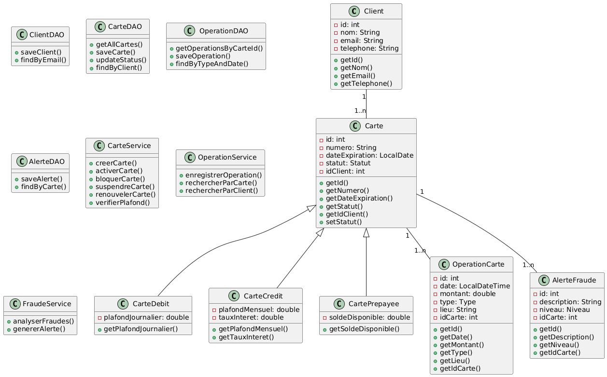

# 🏦 Banking Card Management System


# Diagrame de Classes




## 📋 Description

Un système complet de gestion des cartes bancaires avec détection automatique de fraude, développé en Java avec une architecture en couches. Ce projet permet aux banques de gérer le cycle de vie des cartes, suivre les opérations en temps réel, et détecter automatiquement les comportements suspects.

## 🎯 Objectifs du Projet

- **Gestion du cycle de vie des cartes** : création, activation, suspension, renouvellement
- **Suivi en temps réel** des opérations liées aux cartes
- **Détection automatique de fraude** (achats dans différents pays, montants élevés)
- **Alertes automatiques** et blocage de cartes en cas de fraude potentielle
- **Interface utilisateur intuitive** pour la gestion des cartes

## 🏗️ Architecture

Le projet suit une **architecture en couches** avec séparation claire des responsabilités :

```
┌─────────────────┐
│   UI (MainMenu) │  ← Interface utilisateur
├─────────────────┤
│    Services     │  ← Logique métier
├─────────────────┤
│      DAO        │  ← Accès aux données
├─────────────────┤
│    Entities     │  ← Modèle de données
├─────────────────┤
│   Database      │  ← PostgreSQL
└─────────────────┘
```

## 📊 Modèle de Données

### Entités Principales

#### 🧑‍💼 Client (Record)
```java
public record Client(int id, String nom, String email, String telephone, String password)
```
- Stockage sécurisé des informations client
- Authentification par email/mot de passe

#### 💳 Carte (Sealed Class)
```java
public sealed class Carte permits CarteDebit, CarteCredit, CartePrepayee
```
**Types de cartes disponibles :**
- **CarteDebit** : Plafond journalier configurable
- **CarteCredit** : Plafond mensuel et taux d'intérêt
- **CartePrepayee** : Solde disponible rechargeable

#### 💰 OperationCarte (Record)
```java
public record OperationCarte(int id, Timestamp date, double montant, String type, String lieu, int idCarte)
```
**Types d'opérations :**
- `ACHAT` : Paiements en magasin
- `RETRAIT` : Retraits d'espèces
- `PAIEMENTENLIGNE` : Achats en ligne

#### 🚨 AlerteFraude (Record)
```java
public record AlerteFraude(int id, String description, String niveau, int idCarte)
```
**Niveaux d'alerte :**
- `INFO` : Information simple
- `AVERTISSEMENT` : Situation suspecte
- `CRITIQUE` : Fraude potentielle (blocage automatique)

## 🔧 Technologies Utilisées

- **Java 17** (Records, Sealed Classes, Stream API, Optional)
- **PostgreSQL** (Base de données relationnelle)
- **JDBC** (Connectivité base de données)
- **Architecture MVC** (Modèle-Vue-Contrôleur)

## 🚀 Fonctionnalités

### 👤 Gestion des Clients
- ✅ Inscription de nouveaux clients
- ✅ Authentification sécurisée
- ✅ Gestion du profil client

### 💳 Gestion des Cartes
- ✅ Création de cartes (Débit, Crédit, Prépayée)
- ✅ Activation/Suspension/Blocage des cartes
- ✅ Visualisation des cartes avec numéros masqués
- ✅ Gestion des plafonds et limites

### 💸 Opérations Bancaires
- ✅ Achats en magasin
- ✅ Retraits d'espèces
- ✅ Paiements en ligne
- ✅ Historique détaillé des transactions

### 🛡️ Détection de Fraude
- ✅ **Analyse en temps réel** après chaque opération
- ✅ **Détection de montants élevés** (> 1000€)
- ✅ **Opérations rapprochées** dans des lieux différents
- ✅ **Blocage automatique** pour fraudes critiques
- ✅ **Système d'alertes** multi-niveaux

### 📊 Rapports Personnalisés
- ✅ Utilisation des cartes du client
- ✅ Statistiques par type d'opération
- ✅ Statut des cartes personnelles
- ✅ Rapport complet personnalisé

## 🗄️ Structure de la Base de Données

```sql
-- Clients
CREATE TABLE client (
    id SERIAL PRIMARY KEY,
    nom VARCHAR(100),
    email VARCHAR(100),
    telephone VARCHAR(20),
    password VARCHAR(255) NOT NULL
);

-- Cartes
CREATE TABLE carte (
    id SERIAL PRIMARY KEY,
    numero VARCHAR(20) UNIQUE,
    dateexpiration DATE,
    statut VARCHAR(20),
    typecarte VARCHAR(20),
    plafondjournalier DECIMAL(10,2),
    plafondmensuel DECIMAL(10,2),
    tauxinteret DECIMAL(5,2),
    soldedisponible DECIMAL(10,2),
    idclient INT,
    FOREIGN KEY (idclient) REFERENCES client(id)
);

-- Opérations
CREATE TABLE operationcarte (
    id SERIAL PRIMARY KEY,
    date TIMESTAMP,
    montant DECIMAL(10,2),
    type VARCHAR(20),
    lieu VARCHAR(100),
    idcarte INT,
    FOREIGN KEY (idcarte) REFERENCES carte(id)
);

-- Alertes de fraude
CREATE TABLE alertefraude (
    id SERIAL PRIMARY KEY,
    description VARCHAR(255),
    niveau VARCHAR(20),
    idcarte INT,
    FOREIGN KEY (idcarte) REFERENCES carte(id)
);
```

## ⚙️ Installation et Configuration

### Prérequis
- Java 17 ou supérieur
- PostgreSQL 12 ou supérieur
- IDE Java (IntelliJ IDEA recommandé)

### Étapes d'installation

1. **Cloner le projet**
```bash
git clone https://github.com/votre-username/Banking-Card-Management.git
cd Banking-Card-Management
```

2. **Configurer la base de données**
```bash
# Créer la base de données
createdb banking_db

# Exécuter le script SQL
psql -d banking_db -f src/script.sql
```

3. **Configurer la connexion** (DBUtil.java)
```java
private static final String URL = "jdbc:postgresql://localhost:5432/banking_db";
private static final String USER = "postgres";
private static final String PASSWORD = "votre_mot_de_passe";
```

4. **Compiler et exécuter**
```bash
javac -cp ".:postgresql-driver.jar" src/Main.java
java -cp ".:postgresql-driver.jar" Main
```

## 🎮 Utilisation

### Menu Principal
```
=== Menu Principal ===
1. S'inscrire (Register)
2. Se connecter (Login)
0. Quitter
```

### Dashboard Client
```
=== Dashboard Client ===
1. Voir mes cartes
2. Créer une nouvelle carte
3. Gérer une carte (bloquer/activer)
4. Effectuer une opération
5. Historique des opérations
6. Voir les alertes de fraude
7. Mon profil
8. Voir mes rapports
0. Se déconnecter
```

### Comptes de Test
Le système inclut 10 comptes clients pré-configurés :
- **Email** : alice.martin@email.com, bob.dupont@email.com, etc.
- **Mot de passe** : `123456` (pour tous les comptes de test)

## 🔒 Sécurité

### Authentification
- Connexion par email/mot de passe
- Validation des données d'entrée
- Isolation des données par client

### Protection des Données
- Masquage automatique des numéros de carte (4000****1234)
- Accès aux données limitées au propriétaire
- Chiffrement des mots de passe (à implémenter)

### Détection de Fraude
- **Seuils configurables** pour la détection
- **Analyse multi-critères** (montant, géolocalisation, fréquence)
- **Actions automatiques** (suspension/blocage)

## 📈 Exemples de Détection de Fraude

### Montant Élevé
```
⚠️ ALERTE CRITIQUE
Montant élevé détecté: 1500.00€
Action: Carte automatiquement suspendue
```

### Opérations Rapprochées
```
⚠️ ALERTE AVERTISSEMENT
Opérations dans des lieux différents:
Paris (14:30) → Lyon (14:45)
Action: Alerte générée
```

## 📊 Rapports Disponibles

### Rapports Personnels (Clients)
- **Utilisation des cartes** : Fréquence d'utilisation par carte
- **Statistiques par type** : Répartition ACHAT/RETRAIT/PAIEMENTENLIGNE
- **Statut des cartes** : Active/Suspendue/Bloquée
- **Rapport complet** : Vue d'ensemble personnalisée

## 🚧 Améliorations Futures

### Fonctionnalités Prévues
- [ ] Interface web (Spring Boot + React)
- [ ] API REST pour intégrations externes
- [ ] Chiffrement avancé des données sensibles
- [ ] Géolocalisation avancée pour la détection de fraude
- [ ] Notifications temps réel (email/SMS)
- [ ] Tableau de bord administrateur
- [ ] Export des rapports (PDF/Excel)
- [ ] Intégration avec des services de paiement

### Améliorations Techniques
- [ ] Tests unitaires et d'intégration
- [ ] Documentation API (Swagger)
- [ ] Logging avancé (SLF4J + Logback)
- [ ] Cache Redis pour les performances
- [ ] Monitoring et métriques

## 👥 Équipe de Développement

- **Développeur Principal** : [Votre Nom]
- **Architecture** : Java 17, PostgreSQL, JDBC
- **Méthodologie** : Architecture en couches, Programmation orientée objet

## 📄 Licence

Ce projet est sous licence MIT. Voir le fichier `LICENSE` pour plus de détails.

## 🤝 Contribution

Les contributions sont les bienvenues ! Pour contribuer :

1. Fork le projet
2. Créer une branche feature (`git checkout -b feature/AmazingFeature`)
3. Commit vos changements (`git commit -m 'Add some AmazingFeature'`)
4. Push vers la branche (`git push origin feature/AmazingFeature`)
5. Ouvrir une Pull Request

## 📞 Support

Pour toute question ou problème :
- 📧 Email : votre.email@domain.com
- 🐛 Issues : [GitHub Issues](https://github.com/votre-username/Banking-Card-Management/issues)

---

## 🏆 Fonctionnalités Techniques Avancées

### Java 17 Features Utilisées
- **Records** : Pour les entités immutables (Client, OperationCarte, AlerteFraude)
- **Sealed Classes** : Pour le polymorphisme contrôlé des cartes
- **Pattern Matching** : Dans les switch expressions
- **Stream API** : Pour le traitement des collections
- **Optional** : Pour la gestion des valeurs nulles

### Architecture en Couches
```
📁 src/
├── 📄 Main.java                 # Point d'entrée
├── 📁 entity/                   # Modèle de données
│   ├── Client.java
│   ├── Carte.java (sealed)
│   ├── CarteDebit.java
│   ├── CarteCredit.java
│   ├── CartePrepayee.java
│   ├── OperationCarte.java
│   └── AlerteFraude.java
├── 📁 dao/                      # Accès aux données
│   ├── ClientDAO.java
│   ├── CarteDAO.java
│   ├── OperationDAO.java
│   └── AlerteDAO.java
├── 📁 service/                  # Logique métier
│   ├── ClientService.java
│   ├── CarteService.java
│   ├── OperationService.java
│   ├── FraudeService.java
│   └── RapportService.java
├── 📁 ui/                       # Interface utilisateur
│   └── MainMenu.java
